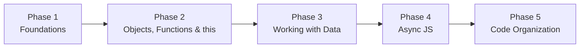

# js-before-react-node

> Everything you need to master in JavaScript before moving on to **React** and **Node.js**.

Each concept lives in its own `.js` file. Work through them **in order**: every file builds on the ones before it.

---

## 📑 Table of Contents

- [Topics Overview](#-topics-overview)
- [Learning Roadmap](#️-learning-roadmap)
  - [Phase 1: Foundations](#phase-1--foundations)
  - [Phase 2: Objects, Functions & `this`](#phase-2--objects-functions--this)
  - [Phase 3: Working with Data](#phase-3--working-with-data)
  - [Phase 4: Async JavaScript](#phase-4--async-javascript)
  - [Phase 5: Code Organization](#phase-5--code-organization)
- [Progress Tracker](#-progress-tracker)
- [How to Run](#️-how-to-run)

---

## 📚 Topics Overview

### 1. Core Language
- `var` / `let` / `const`, scope, hoisting
- Data types, type coercion, `==` vs `===`
- Template literals, destructuring, spread/rest (`...`)

### 2. Functions & `this`
- Function declarations vs expressions vs arrow functions
- `this` binding rules, `call` / `apply` / `bind`
- Closures
- Higher-order functions

### 3. Objects & Arrays
- Object shorthand, computed keys, optional chaining (`?.`), nullish coalescing (`??`)
- Array methods: `map`, `filter`, `reduce`, `find`, `some` / `every`, `forEach` *(critical for React)*

### 4. Async JavaScript
> ⚠️ This is the big one for Node and React.

- Callbacks → Promises → `async` / `await`
- `fetch` / API calls, error handling with `try` / `catch`
- Event loop basics (why `setTimeout` behaves the way it does)

### 5. Modules & Modern Syntax
- ES Modules: `import` / `export`
- Classes, `extends` / `super` *(useful context, less critical than the above)*

### 6. Things That Trip People Up
- Array/object copying (shallow vs deep), mutation pitfalls
- `JSON.stringify` / `JSON.parse`

---

## 🗺️ Learning Roadmap



### Phase 1 — Foundations

| # | File | Topic | Depends on |
|:-:|------|-------|------------|
| 1 | [`letvarconst.js`](./letvarconst.js) | `var` / `let` / `const`, scope | — |
| 2 | [`primitive.js`](./primitive.js) | Data types | — |
| 3 | [`equality.js`](./equality.js) | `==` vs `===`, type coercion | #2 |
| 4 | [`loops.js`](./loops.js) | Control flow | — |

### Phase 2 — Objects, Functions & `this`

| # | File | Topic | Depends on |
|:-:|------|-------|------------|
| 5 | [`destructuring.js`](./destructuring.js) | Object & array destructuring | — |
| 6 | [`spreadrest.js`](./spreadrest.js) | Spread & rest (`...`) | #5 |
| 7 | [`objectfeatures.js`](./objectfeatures.js) | Shorthand, computed keys, `?.`, `??` | — |
| 8 | [`functiontypes.js`](./functiontypes.js) | Declarations vs expressions vs arrows | — |
| 9 | [`this.js`](./this.js) | `this` binding, `call` / `apply` / `bind` | #8 |
| 10 | [`closures.js`](./closures.js) | Closures | #1, #8 |

### Phase 3 — Working with Data

| # | File | Topic | Depends on |
|:-:|------|-------|------------|
| 11 | [`arraymethods.js`](./arraymethods.js) | `map`, `filter`, `reduce`, `find`, `some` / `every`, `forEach` | #8 |
| 12 | [`copyingmutation.js`](./copyingmutation.js) | Reference vs value, shallow vs deep copy | — |
| 13 | [`jsonmethods.js`](./jsonmethods.js) | `JSON.stringify` / `JSON.parse` | — |
| 14 | [`classes.js`](./classes.js) | Classes, `extends` / `super` | #9 |

### Phase 4 — Async JavaScript

> ⚠️ The big one for Node and React.

| # | File | Topic | Depends on |
|:-:|------|-------|------------|
| 15 | [`callbacks.js`](./callbacks.js) | Callbacks | — |
| 16 | [`eventloop.js`](./eventloop.js) | Event loop: why async behaves the way it does | #15 |
| 17 | [`promises.js`](./promises.js) | Promises | #16 |
| 18 | [`asyncawait.js`](./asyncawait.js) | `async` / `await`, `fetch` | #17 |
| 19 | [`trycatch.js`](./trycatch.js) | Error handling with async patterns | #17, #18 |

### Phase 5 — Code Organization

| # | File | Topic | Depends on |
|:-:|------|-------|------------|
| 20 | [`modules.js`](./modules.js) | ES Modules: `import` / `export` | All of the above |

> 💡 Modules come last because they're about splitting code across files, not a new language concept.

---

## ✅ Progress Tracker

**Phase 1 — Foundations**
- [ ] `letvarconst.js`
- [ ] `primitive.js`
- [ ] `equality.js`
- [ ] `loops.js`

**Phase 2 — Objects, Functions & `this`**
- [ ] `destructuring.js`
- [ ] `spreadrest.js`
- [ ] `objectfeatures.js`
- [ ] `functiontypes.js`
- [ ] `this.js`
- [ ] `closures.js`

**Phase 3 — Working with Data**
- [ ] `arraymethods.js`
- [ ] `copyingmutation.js`
- [ ] `jsonmethods.js`
- [ ] `classes.js`

**Phase 4 — Async JavaScript**
- [ ] `callbacks.js`
- [ ] `eventloop.js`
- [ ] `promises.js`
- [ ] `asyncawait.js`
- [ ] `trycatch.js`

**Phase 5 — Code Organization**
- [ ] `modules.js`

---

## ▶️ How to Run

Make sure [Node.js](https://nodejs.org/) is installed, then run any file:

```bash
node letvarconst.js
```

---

<p align="center">Happy learning! 🚀 Next stop: <b>React</b> & <b>Node.js</b></p>
